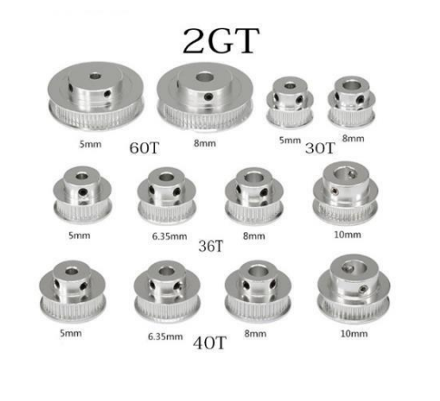
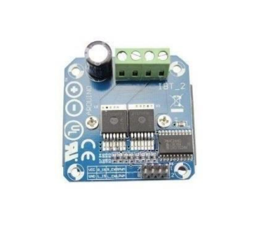
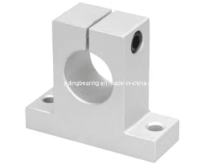
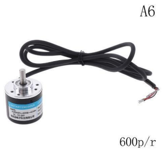
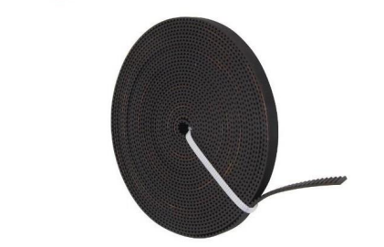
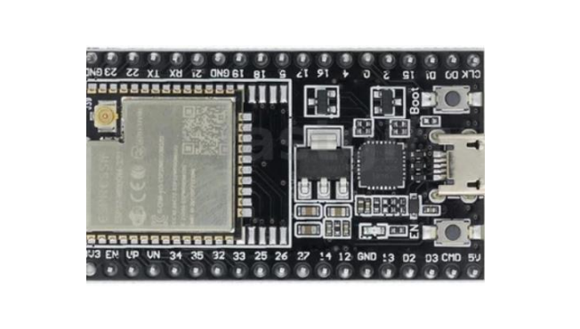
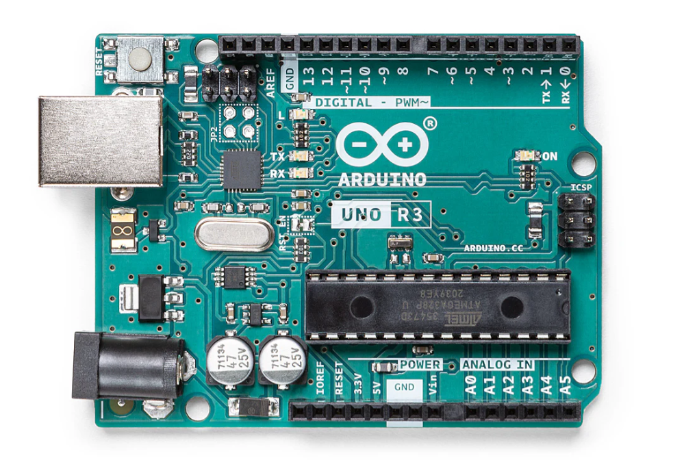

# 1.1 Background
The control of nonlinear dynamic systems is a central challenge in engineering. Among such systems, the inverted pendulum stands as a classic problem, exemplifying the difficulties of controlling inherently unstable systems with nonlinear dynamics. Characterized by its open-loop and closed-loop instability, the inverted pendulum has become a fundamental benchmark in control engineering. It is widely used to test, evaluate, and refine both classical and contemporary control techniques. 

This project aims to demonstrate the modeling and control of a nonlinear inverted pendulum system with the help of MATLAB simulation. By focusing on the development of a dynamic model and the application of control laws, such as the Proportional-Integral-Derivative (PID) controller and Linear Quadratic Regulator (LQR), this work seeks to provide a comprehensive approach to stabilizing the inverted pendulum system.

# 1.2 Objectives
The goal is to develop a stable inverted pendulum setup by designing a classic PID-controller and a model-based controller to maintain the pendulum in a vertical position around the center of the horizontal transport rail.

### Checklist:
- Model and simulate an inverted pendulum system
- Design and develop an inverted pendulum system
- Apply control methods and techniques to the inverted pendulum system
- disturbance rejection, robustness, and swing-up

# 1.3 Materials and Component Specifications

### GT2 Timing Pulleys

- 1 x 30T/5mm Timing Pulley
- 1 x 60T/5mm Timing Pulley

### Motor Large Current Driver Module

**SPECIFICATIONS:**
- Input voltage: 6V-27V
- Model: IBT-2
- Maximum current: 43A
- Input level: 3.3-5V
- Control mode: PWM or level
- Duty cycle: 0-100%

### Linear Rail Shaft Support 8MM SK8

### Photoelectric Incremental Rotary Encoder (5V-24V)

**SPECIFICATIONS:**
- Power source: DC5-24V
- Shaft: 6*13mm / 0.23*0.51"
- Size: 38*35.5mm / 1.49*1.39"
- Output: AB 2-phase output rectangular orthogonal pulse circuit, NPN open collector output type
- Maximum mechanical speed: 5000 RPM
- Response frequency: 0-20KHz

### GT2-6mm Open Timing Belt

- Width: 6mm
- Pitch: 2.0mm
- Material: Rubber

### ESP32 Development Board

### Arduino UNO R3

